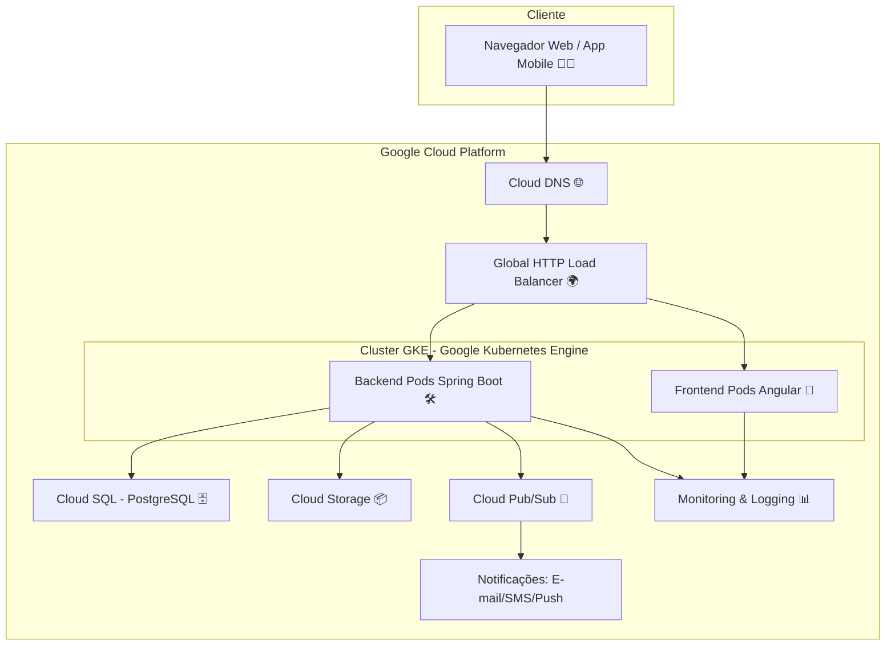

# 02_Arquitetura_Infraestrutura_App_EBD

## 1. Visão Geral da Arquitetura

A arquitetura do App EBD foi concebida para ser **moderna, escalável, segura e altamente disponível**, utilizando as melhores práticas de desenvolvimento de aplicações web e os serviços gerenciados da Google Cloud Platform (GCP). O sistema será dividido em duas partes principais: um **frontend (Angular)** para a interface do usuário e um **backend (Spring Boot)** para a lógica de negócio e acesso a dados. Ambos serão containerizados com **Docker** e orquestrados pelo **Google Kubernetes Engine (GKE)**. O banco de dados principal será o **PostgreSQL**, gerenciado pelo **Cloud SQL**.

## 2. Diagrama de Infraestrutura na GCP

