# 02_Arquitetura_Infraestrutura_App_EBD

## 1. Visão Geral da Arquitetura

A arquitetura do App EBD foi concebida para ser **moderna, escalável, segura e altamente disponível**, utilizando as melhores práticas de desenvolvimento de aplicações web e os serviços gerenciados da Google Cloud Platform (GCP). O sistema será dividido em duas partes principais: um **frontend (Angular)** para a interface do usuário e um **backend (Spring Boot)** para a lógica de negócio e acesso a dados. Ambos serão containerizados com **Docker** e orquestrados pelo **Google Kubernetes Engine (GKE)**. O banco de dados principal será o **PostgreSQL**, gerenciado pelo **Cloud SQL**.

## 2. Diagrama de Infraestrutura na GCP

```mermaid

graph TD
    
    subgraph Cliente
        A[Navegador Web / App Mobile 🧑‍💻]
    end

    
    subgraph Google Cloud Platform 
        B[Cloud DNS 🌐] --> C[Global HTTP Load Balancer 🌍]

        subgraph Cluster GKE - Google Kubernetes Engine 
            D[Frontend Pods Angular 🎨]
            E[Backend Pods Spring Boot 🛠️]
        end

        C --> D
        C --> E

        E --> F[Cloud SQL - PostgreSQL 🗄️]
        E --> G[Cloud Storage 📦]
        E --> H[Cloud Pub/Sub 📨]

        H --> I[Notificações: E-mail/SMS/Push]

        D --> J[Monitoring & Logging 📊]
        E --> J
    end

    A --> B   
```

